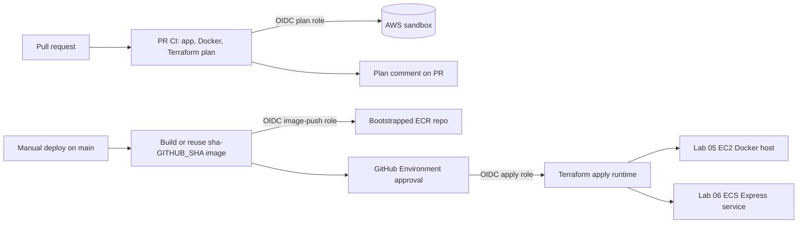

# ADR 0001: CI/CD for EC2 and ECS Static Site Labs

- Status: Proposed
- Date: 2026-06-11
- Scope: `labs/05-static-site-ec2/`, `labs/06-static-site-ecs/`
- Related workflow document: [`docs/container-cicd-ec2-ecs.md`](../container-cicd-ec2-ecs.md)
- Diagram: [`docs/lab-ec2-ecs-cicd-pipeline.drawio`](../lab-ec2-ecs-cicd-pipeline.drawio)

## Context

Labs 05 and 06 deploy the same React/Vite CIDR calculator as an Nginx container image. Lab 05 runs the image on one EC2 Docker host. Lab 06 runs it on ECS Express Mode. The CI/CD design should teach safe cloud deployment without long-lived AWS credentials in GitHub. This ADR documents the proposed architecture only; workflow implementation is intentionally separate.

## Decision

Use GitHub Actions with AWS OIDC for repository `noidilin/portfolio-devops`, split durable bootstrap resources from disposable runtime resources, and require manual approval only for real AWS provisioning.

## CI/CD architecture

### AWS sandbox bootstrap

Bootstrap is run locally with the student's AWS sandbox credentials, not by the normal deployment workflow.

- One shared GitHub OIDC provider: `token.actions.githubusercontent.com`.
- Per-lab ECR repositories are durable artifact stores.
- Per-lab GitHub roles:
  - `github-plan`: read-style Terraform plan on pull requests.
  - `github-image-push`: branch-scoped ECR push from `main`.
  - `github-apply`: environment-scoped Terraform apply/destroy.
- Apply roles use the lab permissions boundary documented under `docs/aws-sandbox/`.

This avoids storing AWS access keys in GitHub secrets. GitHub receives a short-lived OIDC token, AWS STS exchanges it for a scoped role session, and IAM trust conditions restrict which workflow context may assume each role.

### PR workflow

`.github/workflows/lab-container-ci.yml` runs automatically on pull requests. It detects which lab changed, then runs only that lab unless shared CI/bootstrap files changed.

For each affected lab it:

1. installs the toolchain with `mise`;
2. runs `pnpm install --frozen-lockfile`, lint, test, and build;
3. builds the Docker image and smoke tests it locally;
4. assumes the lab `github-plan` role through OIDC;
5. runs `terraform fmt`, `validate`, and `plan` with `image_tag=sha-${GITHUB_SHA}`;
6. posts the Terraform plan as a PR comment.

The PR workflow is intentionally read-only for AWS infrastructure. It can preview changes but cannot apply them.

### Image artifact promotion

The deploy workflow uses immutable image tags: `sha-${GITHUB_SHA}`.

- If the ECR image for that SHA already exists, the workflow reuses it.
- If it does not exist, the workflow builds, smoke tests, and pushes it using the ECR-only `github-image-push` role.
- Promotion to runtime happens by passing the exact SHA tag to Terraform during the approved apply.

This is safer than `latest` or `stage`: a rerun deploys the same image digest, and Terraform can show exactly which image tag is being promoted.

### Manual approval for provisioning

`.github/workflows/lab-container-deploy.yml` is manually dispatched from `main`. It performs preflight checks before approval, then the `apply` job enters the GitHub Environment gate:

- `lab-05-stage` for EC2
- `lab-06-stage` for ECS

Only after the reviewer approves does the job assume the environment-scoped `github-apply` role and run `terraform apply`.

`.github/workflows/lab-container-destroy.yml` uses the same environment approval model, but only destroys runtime infrastructure. It does not destroy OIDC, IAM bootstrap roles, or ECR image history.

## Consequences

- Good: no long-lived AWS secrets in GitHub.
- Good: PRs get automated checks and Terraform plan comments.
- Good: actual AWS provisioning is manually approved.
- Good: bootstrap resources survive runtime destroy, so images and roles remain reusable.
- Trade-off: bootstrap Terraform must exist and be applied before workflows can succeed.
- Trade-off: a third `github-image-push` role is needed so image push can happen before Terraform apply approval while still keeping provisioning gated.
