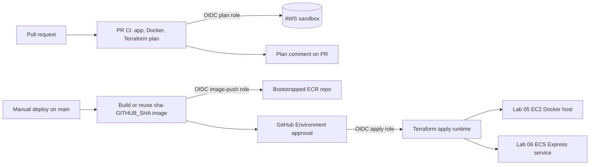

# ADR 0001：EC2 與 ECS 靜態網站 Lab 的 CI/CD

- 狀態：已接受
- 日期：2026-06-11
- 範圍：`labs/05-static-site-ec2/`、`labs/06-static-site-ecs/`

## 背景

Lab 05 與 Lab 06 會將同一個 React/Vite CIDR 計算機部署為 Nginx 容器映像檔。Lab 05 在一台 EC2 Docker 主機上執行該映像檔。Lab 06 則在 ECS Express Mode 上執行。CI/CD 設計應教導安全的雲端部署方式，避免在 GitHub 中使用長期有效的 AWS 憑證。

## 決策

使用搭配 AWS OIDC 的 GitHub Actions，將持久性的 bootstrap 資源與可拋棄的 runtime 資源分離，並且只在真正佈建 AWS 資源時要求手動核准。

## CI/CD 架構

### AWS sandbox bootstrap

Bootstrap 會使用學生的 AWS sandbox 憑證在本機執行，而不是由一般部署 workflow 執行。

- 一個共用的 GitHub OIDC provider：`token.actions.githubusercontent.com`。
- 每個 lab 各自的 ECR repository 是持久性的 artifact store。
- 每個 lab 各自的 GitHub role：
  - `github-plan`：在 pull request 上執行偏讀取型的 Terraform plan。
  - `github-image-push`：從 `main` 進行 branch-scoped 的 ECR push。
  - `github-apply`：執行 environment-scoped 的 Terraform apply/destroy。
- Apply role 會使用記錄於 `docs/aws-sandbox/` 底下的 lab permissions boundary。

這可以避免在 GitHub secrets 中儲存 AWS access key。GitHub 會取得短期有效的 OIDC token，AWS STS 會將其交換成限定範圍的 role session，而 IAM trust condition 會限制哪些 workflow context 可以 assume 各個 role。

### PR workflow

`.github/workflows/lab-container-ci.yml` 會在 pull request 上自動執行。它會偵測哪個 lab 有變更，然後只執行該 lab；除非共用的 CI/bootstrap 檔案有變更，才會擴大執行範圍。

對每個受影響的 lab，它會：

1. 使用 `mise` 安裝 toolchain；
2. 執行 `pnpm install --frozen-lockfile`、lint、test 與 build；
3. 建置 Docker image，並在本機執行 smoke test；
4. 透過 OIDC assume 該 lab 的 `github-plan` role；
5. 以 `image_tag=sha-${GITHUB_SHA}` 執行 `terraform fmt`、`validate` 與 `plan`；
6. 將 Terraform plan 作為 PR comment 發佈。

PR workflow 對 AWS infrastructure 刻意維持唯讀。它可以預覽變更，但不能套用變更。

### Image artifact promotion

Deploy workflow 使用不可變的 image tag：`sha-${GITHUB_SHA}`。

- 如果該 SHA 對應的 ECR image 已經存在，workflow 會重複使用它。
- 如果不存在，workflow 會使用僅限 ECR 的 `github-image-push` role 來建置、smoke test 並推送它。
- Promotion 到 runtime 的方式，是在已核准的 apply 期間，將精確的 SHA tag 傳給 Terraform。

這比使用 `latest` 或 `stage` 更安全：重新執行會部署相同的 image digest，而 Terraform 可以清楚顯示正在 promotion 的確切 image tag。

### 佈建的手動核准

`.github/workflows/lab-container-deploy.yml` 會從 `main` 手動觸發。它會先執行 preflight check，然後 `apply` job 進入 GitHub Environment gate：

- `lab-05-stage` 用於 EC2
- `lab-06-stage` 用於 ECS

只有在 reviewer 核准後，job 才會 assume environment-scoped 的 `github-apply` role，並執行 `terraform apply`。

`.github/workflows/lab-container-destroy.yml` 使用相同的 environment approval 模型，但只會銷毀 runtime infrastructure。它不會銷毀 OIDC、IAM bootstrap role，或 ECR image history。

## 後果

- 優點：GitHub 中沒有長期有效的 AWS secret。
- 優點：PR 會獲得自動化檢查與 Terraform plan comment。
- 優點：實際 AWS 佈建需要手動核准。
- 優點：bootstrap 資源會在 runtime destroy 後保留下來，因此 image 與 role 仍可重複使用。
- 取捨：bootstrap Terraform 必須存在並且先套用，workflow 才能成功。
- 取捨：需要第三個 `github-image-push` role，讓 image push 可以在 Terraform apply 核准前發生，同時仍維持佈建 gated。
